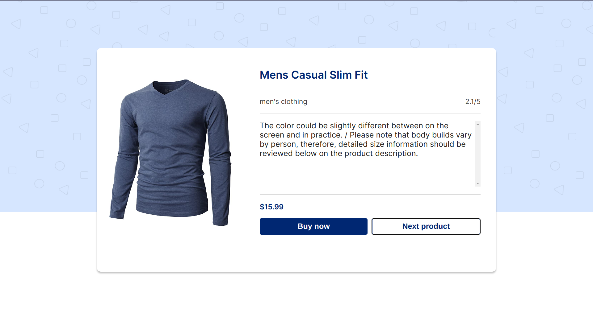

<div align="center">

<!-- PROJECT LOGO -->

# Ecommerce-catalog


</div>

> Ecommerce merupakan projek akhir dari program Core Initiative Frontend Virtual Internship Program

## ✨ Demo

Here is a working live demo : [Demo](https://ecommerce-rizalyoga.web.app/)

## 🔮 Features

- Fetch data from fakestore api.
- change the display color based on product category

## 🖼️ UI Preview



## 🧰 Run in locale

To clone and run this website, you'll need [Git](https://git-scm.com) and [Node.js](https://nodejs.org/en/download/) (which comes with [yarn](https://yarnpkg.com/) installed on your computer. From your command line:

```bash
# Clone this repository
$ git clone https://github.com/rizalyoga/ecommerce-catalog.git

# Go into the repository
$ cd ecommerce-catalog

# Install dependencies
$ yarn

# Run the app
$ yarn dev

```

## ⛏️ Built With

- [Vite](https://vitejs.dev/)
- [Vue js](https://vuejs.org/)
- [Fakestore api](https://fakestoreapi.com/)

## 👤 Authors

- [Rizalyoga](https://github.com/rizalyoga/)

<!-- ## 🙊 Environment Variables

To run this project, you will need to add the following environment variables to your .env file

`REACT_APP_API_URL`

That contains the endpoint for the backend -->
